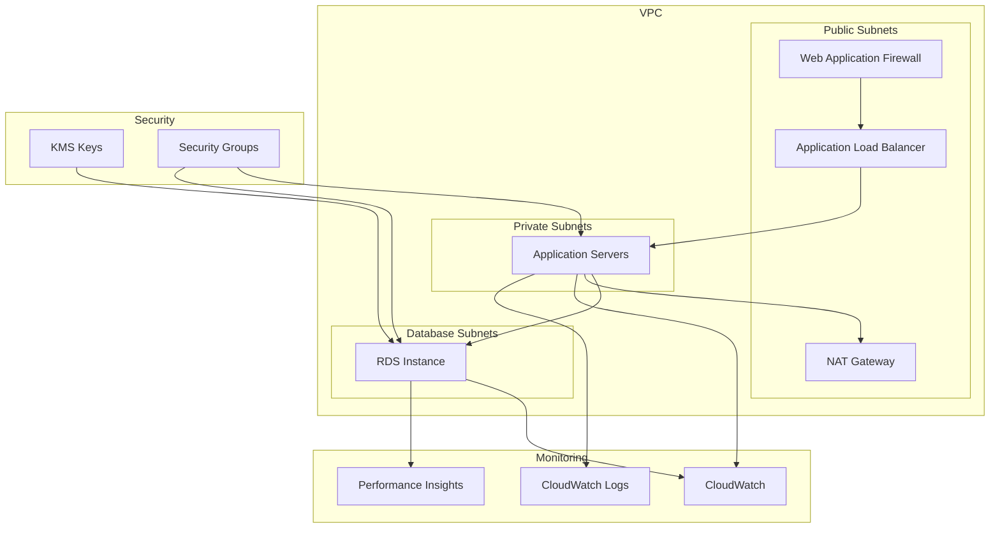

# Terraform Multi-Environment Infrastructure

Production-grade AWS infrastructure orchestration across us-west-1 and us-west-2 regions. Implements environment-specific resource sizing, security policies, ## Environment-Specific Configurations

### Development Environments
- **Cost Optimization**: Single NAT gateway deployment saves $45/month per environment
- **Monitoring**: Basic CloudWatch metrics sufficient for development workflows
- **Security**: Relaxed security groups for development velocity
- **Scaling**: Fixed capacity to prevent unexpected cost escalation

### Staging Environment  
- **Production Parity**: Identical architecture patterns with scaled-down resources
- **Testing**: Full security rule enforcement to identify issues pre-production
- **Monitoring**: Enhanced metrics collection for performance validation
- **Data**: Production-like data volumes for realistic load testing

### Production Environment
- **Availability**: Multi-AZ deployment targeting 99.95% uptime SLA
- **Performance**: Enhanced monitoring with 10-second metric intervals
- **Security**: Comprehensive WAF rule set with rate limiting and DDoS protection
- **Compliance**: 365-day log retention supporting SOC2 and PCI-DSS audits
- **Backup**: Automated cross-region backup with point-in-time recoveryntrols optimized for development velocity and production reliability.

## Architecture Overview

```
terraform-michael/
├── us-west-1/          # Primary region - full environment lifecycle
│   ├── dev/            # Cost-optimized development with minimal redundancy
│   ├── staging/        # Production-replica for integration testing
│   └── prod/           # High-availability production with full monitoring
└── us-west-2/          # Secondary region - development overflow
    └── dev/            # Isolated development for distributed teams
```

## Resource Configuration

### Network Infrastructure

| Resource Type | Dev (us-west-1) | Dev (us-west-2) | Staging (us-west-1) | Prod (us-west-1) |
|--------------|-----------------|-----------------|-------------------|-----------------|
| VPC CIDR | 10.0.0.0/16 | 172.16.0.0/16 | 192.168.0.0/16 | 172.20.0.0/16 |
| Availability Zones | 2 AZs | 3 AZs | 2 AZs | 2 AZs |
| NAT Gateways | Single (cost saving) | Single (cost saving) | One per AZ | One per AZ |
| VPC Flow Logs | Basic | Enhanced | Enhanced | Full logging |
| Network Metrics | Basic | Basic | Enhanced | Complete monitoring |

### Compute Resources

| Resource Type | Dev (us-west-1) | Dev (us-west-2) | Staging (us-west-1) | Prod (us-west-1) |
|--------------|-----------------|-----------------|-------------------|-----------------|
| Instance Type | t3.micro | t3.small | t3.medium | m5.large |
| Auto Scaling | No | No | Yes (mirrors prod) | Yes |
| Load Balancer | ALB (HTTP only) | ALB (HTTP/HTTPS) | ALB (HTTPS only) | ALB (HTTPS only) |
| WAF | No | No | Basic protection | Full rule set + rate limiting |

### Database Configuration

| Resource Type | Dev (us-west-1) | Dev (us-west-2) | Staging (us-west-1) | Prod (us-west-1) |
|--------------|-----------------|-----------------|-------------------|-----------------|
| RDS Instance | db.t3.small | db.t3.medium | db.t3.large | db.m5.xlarge |
| Multi-AZ | No (cost saving) | No (cost saving) | Yes (matches prod) | Yes |
| Storage (GB) | 20-100 | 50-200 | 100-500 | 200-1000 |
| Backup Retention | 7 days | 14 days | 14 days | 30 days (compliance) |
| Performance Insights | 7 days | 14 days | 14 days | 731 days (full history) |
| Parameter Tuning | Basic | Enhanced | Enhanced | Production-optimized |

### Security Configuration

| Feature | Dev (us-west-1) | Dev (us-west-2) | Staging (us-west-1) | Prod (us-west-1) |
|---------|-----------------|-----------------|-------------------|-----------------|
| SSL/TLS | Optional | Required | Required | Required + strict policy |
| KMS Keys | Basic | Multi-region | Multi-region | Multi-region + enhanced IAM |
| Security Groups | Basic rules | Enhanced rules | Strict access control | Production-grade |
| WAF Rules | None | None | Basic rule set | Complete + rate limiting |
| Deletion Protection | No | No | Yes | Yes |

### Monitoring & Logging

| Feature | Dev (us-west-1) | Dev (us-west-2) | Staging (us-west-1) | Prod (us-west-1) |
|---------|-----------------|-----------------|-------------------|-----------------|
| Log Retention | 30 days | 30 days | 90 days | 365 days |
| RDS Monitoring | 60s intervals | 30s intervals | 30s intervals | 10s intervals |
| CloudWatch Alarms | Basic | Enhanced | Enhanced | Complete coverage |
| Health Checks | Basic | Enhanced | Enhanced | Production-grade |

### Compliance & Tagging

| Feature | Dev (us-west-1) | Dev (us-west-2) | Staging (us-west-1) | Prod (us-west-1) |
|---------|-----------------|-----------------|-------------------|-----------------|
| Environment Tag | dev | dev | staging | prod |
| Data Classification | internal | internal | internal | confidential |
| Backup Schedule | None | None | daily | hourly |
| Compliance Standards | None | None | Basic | PCI-DSS, SOC2 |

## Infrastructure Diagram Generation

Leverage [blast-radius](https://github.com/28mm/blast-radius) for interactive Terraform dependency visualization and architecture documentation.

### Prerequisites

```bash
# Core dependencies
pip install blastradius
# Platform-specific Graphviz installation
# Windows: choco install graphviz
# macOS:   brew install graphviz  
# Linux:   apt-get install graphviz
```

### Diagram Operations

```bash
make diagrams          # Generate static SVG diagrams for all environments
make serve-dev         # Launch interactive development environment server
make serve-staging     # Launch interactive staging environment server  
make serve-prod        # Launch interactive production environment server
make docker-diagrams   # Containerized diagram generation (dependency-free)
```

### Advanced Usage

```bash
# Generate diagrams for specific environment
python generate_diagrams.py generate

# Start interactive server with custom port
python generate_diagrams.py serve --environment us-west-1/dev --port 8080

# Docker-based generation (isolated environment)
docker-compose up diagram-generator
```



## Resource Naming Convention

```
{project}-{environment}-{region-abbr}-{resource-type}-{suffix?}
```

Examples:
- `terraform-michael-prod-usw1-rds-primary`
- `terraform-michael-dev-usw2-alb`
- `terraform-michael-staging-usw1-kms-db`

## Deployment Requirements

- **AWS Provider**: 6.2.0 (pinned for reproducible deployments)
- **Terraform**: ≥1.13.0 (required for reliable remote state management)
- **AWS CLI**: ≥2.0 with configured profiles
- **IAM Permissions**: Deployment-specific policies documented per environment

## Operational Procedures

### Pre-Deployment Checklist
1. Verify AWS credentials and target account
2. Review Terraform plan output for unexpected changes
3. Confirm backup completion for stateful resources
4. Validate SSL certificate availability (ALB dependencies)
5. Check WAF rule compatibility with application requirements

### Post-Deployment Validation
1. Verify health check endpoints respond correctly
2. Confirm CloudWatch alarms trigger appropriately
3. Test database connectivity from application instances
4. Validate security group rules against compliance requirements

## Deployment Workflow

```bash
# Environment-specific deployment
cd us-west-1/prod
cp terraform.tfvars.example terraform.tfvars
# Configure environment-specific variables
terraform init
terraform plan -out=deployment.plan
terraform apply deployment.plan
```

## Environment-Specific Notes

### Development
- Single NAT gateway reduces costs by $45/month
- No auto-scaling to prevent unexpected charges
- Basic monitoring sufficient for development workflow

### Staging  
- Mirrors production architecture for realistic testing
- Reduced instance sizes to control costs
- Full security rules to catch issues before production

### Production
- Multi-AZ for 99.95% uptime SLA
- Enhanced monitoring with 10-second intervals
- Complete WAF rule set including rate limiting
- 365-day log retention for compliance audits