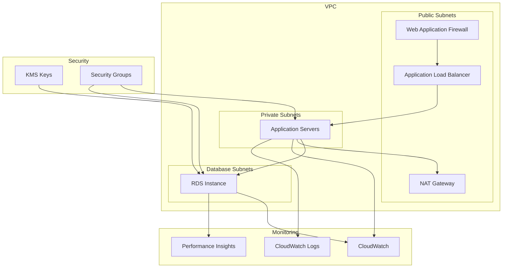

# Terraform Infrastructure Resource Map

This repository contains Infrastructure as Code (IaC) definitions for a multi-environment AWS deployment in us-west-1 and us-west-2 regions.

## Environment Overview

```
terraform-michael/
├── us-west-1/
│   ├── dev/         # Development Environment
│   ├── staging/     # Staging/Pre-production Environment
│   └── prod/        # Production Environment
└── us-west-2/
    └── dev/         # Development Environment
```

## Resource Configuration Matrix

### Network Infrastructure

| Resource Type | Dev (us-west-1) | Dev (us-west-2) | Staging (us-west-1) | Prod (us-west-1) |
|--------------|-----------------|-----------------|-------------------|-----------------|
| VPC CIDR | 10.0.0.0/16 | 172.16.0.0/16 | 192.168.0.0/16 | 172.20.0.0/16 |
| Availability Zones | 2 AZs | 3 AZs | 2 AZs | 2 AZs |
| NAT Gateways | Single | Single | One per AZ | One per AZ |
| VPC Flow Logs | Basic | Enhanced | Enhanced | Full Logging |
| Network Metrics | Basic | Basic | Enhanced | Complete |

### Compute Resources

| Resource Type | Dev (us-west-1) | Dev (us-west-2) | Staging (us-west-1) | Prod (us-west-1) |
|--------------|-----------------|-----------------|-------------------|-----------------|
| Instance Type | t3.micro | t3.small | t3.medium | m5.large |
| Auto Scaling | No | No | Yes | Yes |
| Load Balancer | ALB (HTTP) | ALB (HTTP/HTTPS) | ALB (HTTPS) | ALB (HTTPS) |
| WAF | No | No | Basic Rules | Enhanced Rules |

### Database Configuration

| Resource Type | Dev (us-west-1) | Dev (us-west-2) | Staging (us-west-1) | Prod (us-west-1) |
|--------------|-----------------|-----------------|-------------------|-----------------|
| RDS Instance | db.t3.small | db.t3.medium | db.t3.large | db.m5.xlarge |
| Multi-AZ | No | No | Yes | Yes |
| Storage (GB) | 20 Initial, 100 Max | 50 Initial, 200 Max | 100 Initial, 500 Max | 200 Initial, 1000 Max |
| Backup Retention | 7 days | 14 days | 14 days | 30 days |
| Performance Insights | 7 days | 14 days | 14 days | 731 days |
| Parameter Optimization | Basic | Enhanced | Enhanced | Production-Grade |

### Security Configuration

| Feature | Dev (us-west-1) | Dev (us-west-2) | Staging (us-west-1) | Prod (us-west-1) |
|---------|-----------------|-----------------|-------------------|-----------------|
| SSL/TLS | Optional | Required | Required | Required + Modern Policy |
| KMS Keys | Basic | Multi-Region | Multi-Region | Multi-Region + Enhanced Policy |
| Security Groups | Basic | Enhanced | Strict | Production-Grade |
| WAF Rules | None | None | Basic Set | Complete Set + Rate Limiting |
| Deletion Protection | No | No | Yes | Yes |

### Monitoring & Logging

| Feature | Dev (us-west-1) | Dev (us-west-2) | Staging (us-west-1) | Prod (us-west-1) |
|---------|-----------------|-----------------|-------------------|-----------------|
| Log Retention | 30 days | 30 days | 90 days | 365 days |
| RDS Monitoring | 60s | 30s | 30s | 10s |
| CloudWatch Alarms | Basic | Enhanced | Enhanced | Comprehensive |
| Health Checks | Basic | Enhanced | Enhanced | Production-Grade |

### Compliance & Tagging

| Feature | Dev (us-west-1) | Dev (us-west-2) | Staging (us-west-1) | Prod (us-west-1) |
|---------|-----------------|-----------------|-------------------|-----------------|
| Environment Tag | dev | dev | staging | prod |
| Data Classification | internal | internal | internal | confidential |
| Backup Schedule | None | None | daily | hourly |
| Compliance Standards | None | None | Basic | PCI-DSS, SOC2 |

## Infrastructure Diagram



## Common Resource Naming Pattern

```
{project}-{environment}-{region-abbr}-{resource-type}
```

Example: `terraform-michael-prod-usw1-rds`

## Required Providers

- AWS Provider Version: 6.2.0
- Terraform Version: 1.13.0

## Notes

1. Production environment includes additional security measures and monitoring
2. Staging environment mirrors production configuration with reduced capacity
3. Development environments are optimized for cost while maintaining security
4. All environments use encrypted storage and secure communication
5. Resource sizing and configuration follow AWS Well-Architected Framework

## Getting Started

1. Navigate to the desired environment directory
2. Update the `terraform.tfvars` file with your specific values
3. Initialize Terraform: `terraform init`
4. Review the plan: `terraform plan`
5. Apply the configuration: `terraform apply`

## Important Considerations

- Production and Staging environments require manual approval for changes
- Database snapshots are automatically created before any changes
- SSL certificates must be provisioned before deploying ALB
- WAF rules should be reviewed and customized per environment
- CloudWatch alarms require SNS topic configuration for notifications